# 📌 **JobGo - Job Search & Recruitment App**  

**JobGo** is a Flutter-based job search and recruitment application designed to help job seekers find the best job opportunities and apply directly from the app. It also allows companies to connect with potential candidates efficiently. The app integrates Firebase for authentication, database storage, and job management while providing a seamless experience for users.  
🚧 Note: This project is still in progress and under active development. Some features may not be fully implemented yet. 🚧


---


 


---


## 📖 **Table of Contents**  
- [Features](#features)  
- [Tech Stack](#tech-stack)  
- [Installation](#installation)
- [Project Structure](#project-structure)  
- [Screenshots](#screenshots)  
- [How It Works](#how-it-works)  
- [Firebase Configuration](#firebase-configuration)  
- [Admin Panel](#admin-panel)  
- [License](#license)
- [Author](#author)  


---


## 🎯 **Features**  
✔️ **20+** professionally designed screens for a smooth and intuitive user experience.  
✔️ **User Authentication:** Email/password sign-up, sign-in, and Google authentication.  
✔️ **Job Listings:** Users can browse, search, and filter job postings.  
✔️ **Job Details:** Detailed view with job descriptions, salary, company info, and requirements.  
✔️ **Apply for Jobs:** Submit job applications directly from the app.  
✔️ **Save Favorite Jobs:** Users can save jobs for later.  
✔️ **Filters & Search:** Advanced job filters based on location, salary, experience, etc.  
✔️ **Company Dashboard:** Employers can post jobs and manage applicants.  
✔️ **Application Tracking:** Users can view their application status.  
✔️ **Chat with Recruiters:** Real-time messaging with hiring managers.  
✔️ **Profile Management:** Users can upload resumes and update professional details.  


---


## 💻 **Tech Stack**  
- **Frontend:** Flutter (Dart)  
- **Backend:** Firebase (Firestore, Authentication, Storage)  
- **State Management:** Riverpod  
- **Database:** Firestore (NoSQL)  
- **Authentication:** Firebase Auth  
- **Storage:** Firebase Storage (for resumes and profile images)  


---


## 🛠 **Installation**  

1️⃣ **Clone the Repository**  
```bash
git clone https://github.com/FaizanAhmed44/jobgo.git
```  
2️⃣ **Navigate to the Project Directory**  
```bash
cd jobgo
```  
3️⃣ **Install Dependencies**  
```bash
flutter pub get
```  
4️⃣ **Run the App**  
```bash
flutter run
```  


---


## 📂 **Project Structure**  
```
jobgo/
│── 📦 your-flutter-app-repo
├── 📂 lib
│   ├── 📂 const
│   ├── 📂 features
│   │   ├── 📂 auth
│   │   │   ├── 📂 login
│   │   │   ├── 📂 signup
│   │   │   ├── 📂 google_auth
│   │   ├── 📂 job_seeker
│   │   │   ├── 📂 job_listings
│   │   │   ├── 📂 job_details
│   │   │   ├── 📂 apply_job
│   │   │   ├── 📂 saved_jobs
│   │   │   ├── 📂 search_jobs
│   │   │   ├── 📂 filters
│   │   │   ├── 📂 profile
│   │   │   ├── 📂 applications_tracking
│   │   ├── 📂 employer
│   │   │   ├── 📂 post_jobs
│   │   │   ├── 📂 manage_applicants
│   │   │   ├── 📂 dashboard
│   │   │   ├── 📂 chat
│   │   ├── 📂 shared
│   │   │   ├── 📜 helperclass.dart
│   │   │   ├── 📜 sharedclass.dart
├── 📂 theme
├── 📂 utils
├── 📜 firebase_options.dart
├── 📜 main.dart
└── 📜 README.md
│── assets/
│── pubspec.yaml
│── README.md
```  


### 📂 **Main Folder Breakdown**  
- **lib/** → Main application codebase, including features, UI, and logic.  
- **theme/** → Defines app-wide styling, colors, and fonts.  
- **utils/** → Contains utility functions and helper classes.  
- **assets/** → Stores static resources like images, icons, and fonts.  
- **firebase_options.dart** → Firebase configuration settings.  
- **main.dart** → Entry point of the Flutter application.  
- **pubspec.yaml** → Defines dependencies, assets, and app configurations.  
- **README.md** → Project documentation file.  


---


## 📸 **Screenshots**  


> ### **Light Mode**


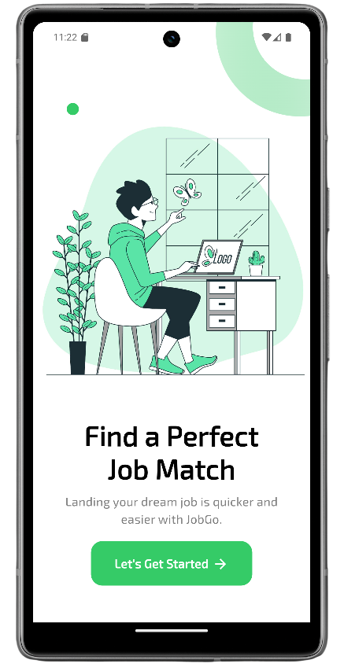     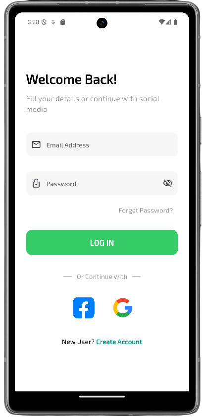     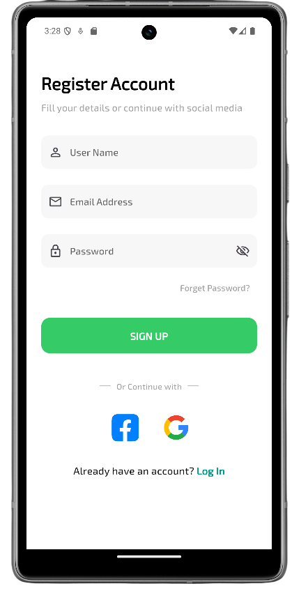     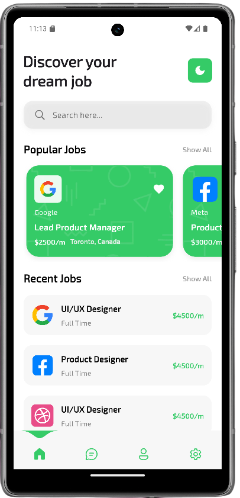     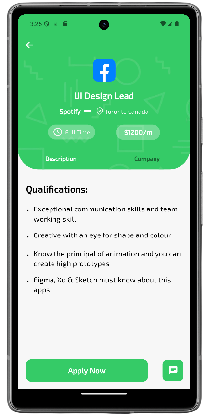     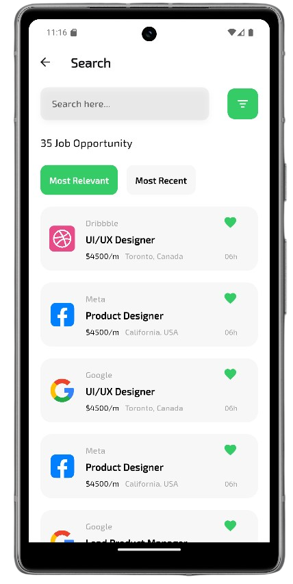     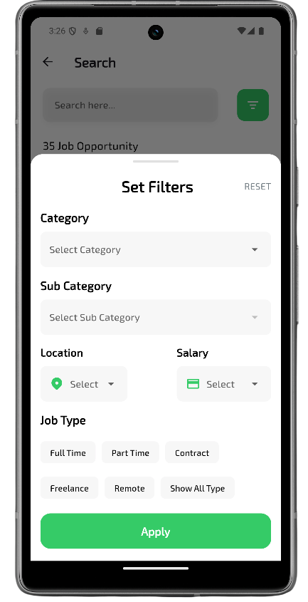     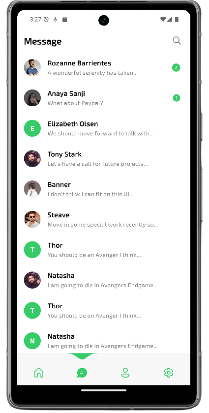     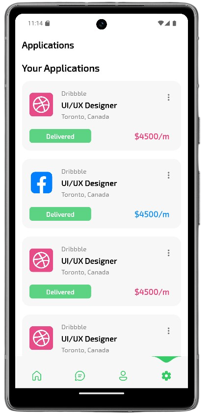     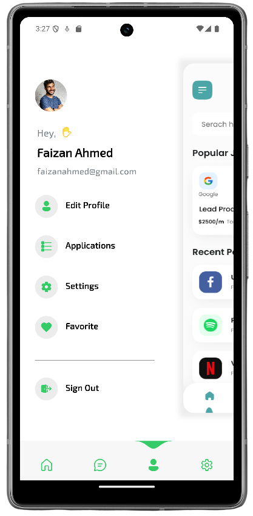     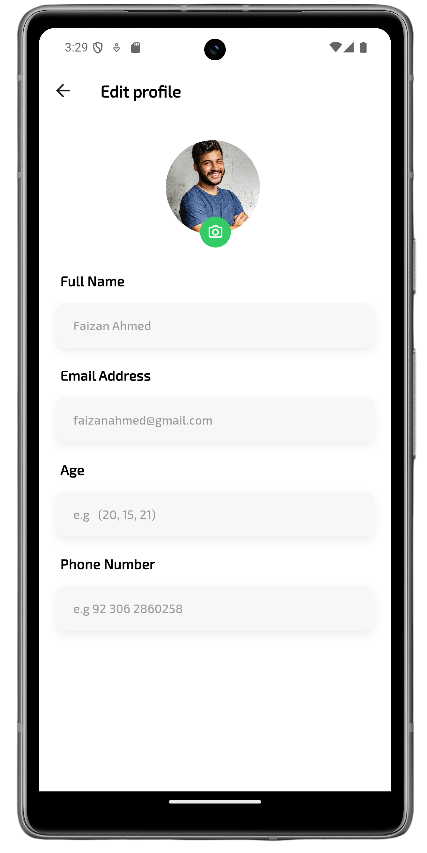     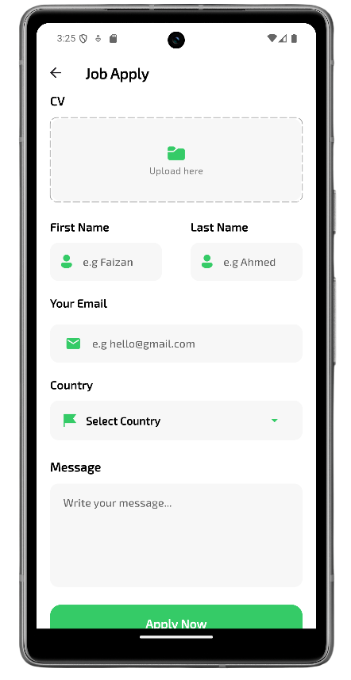 


> ### **Dark Mode**


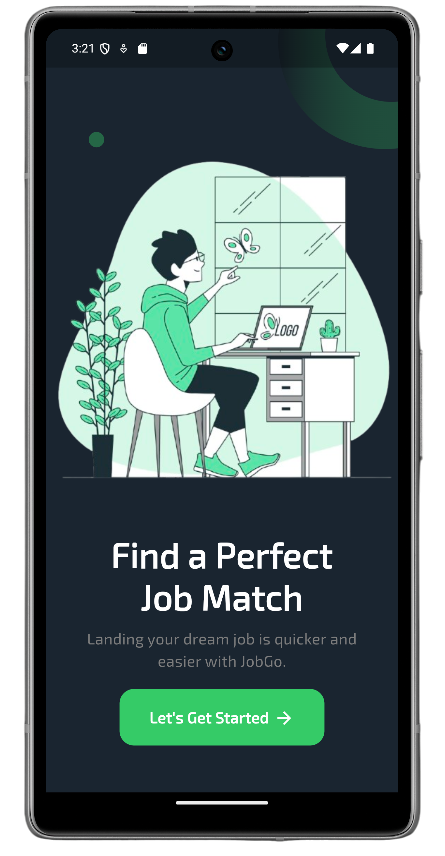     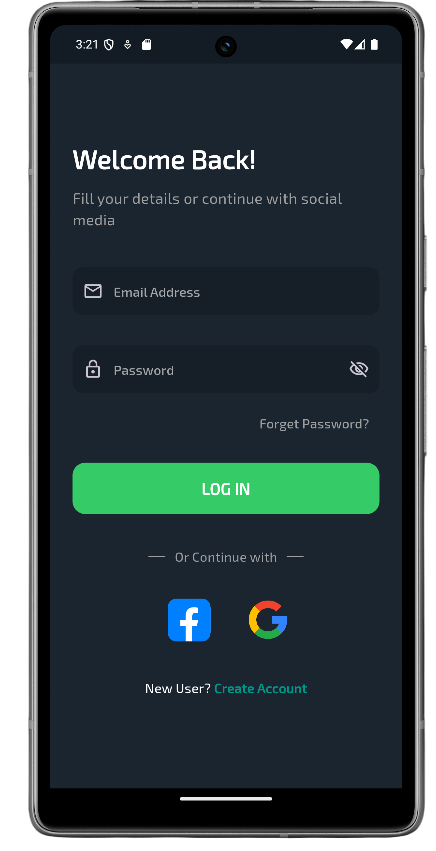     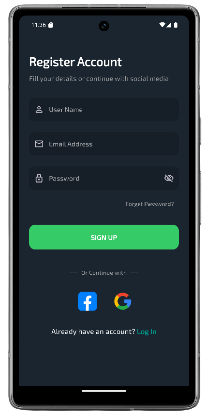     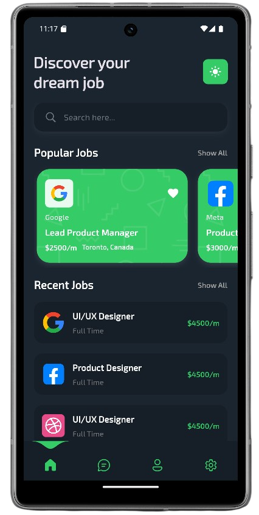     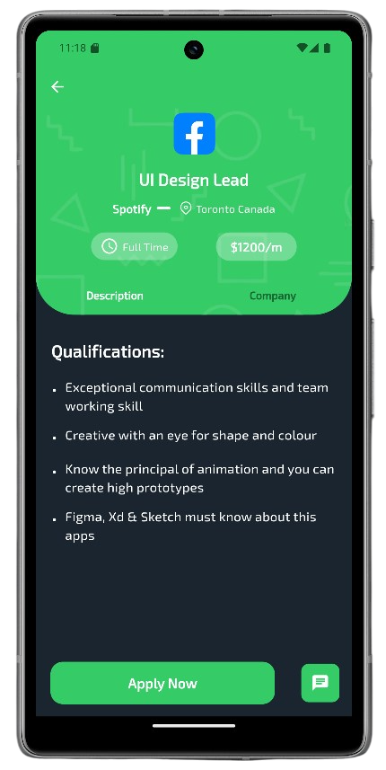     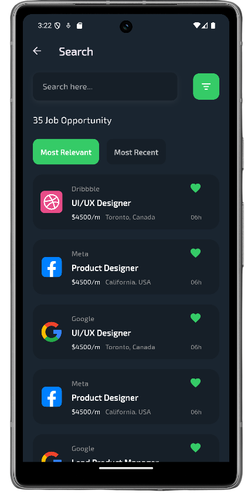     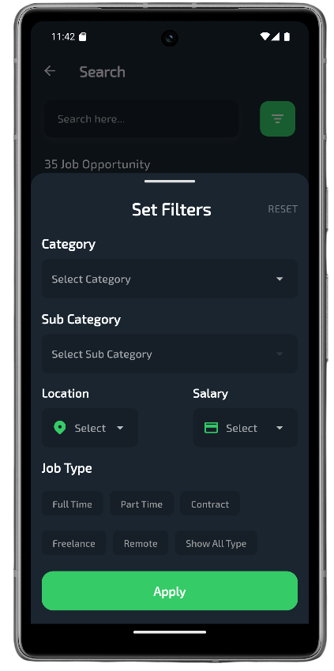     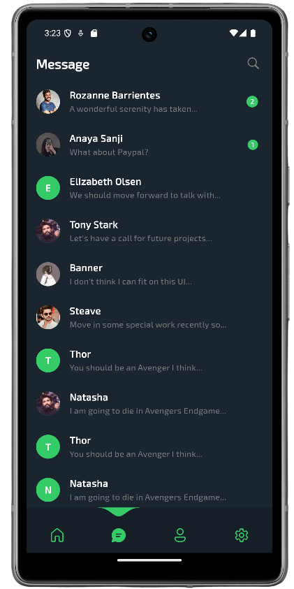     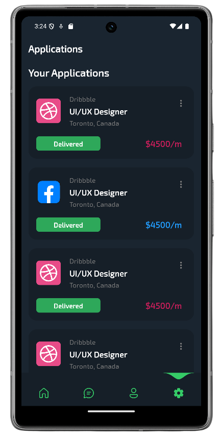     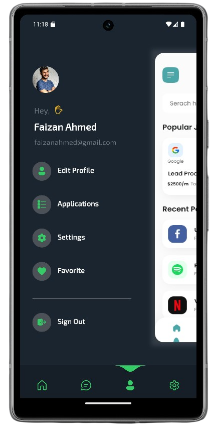     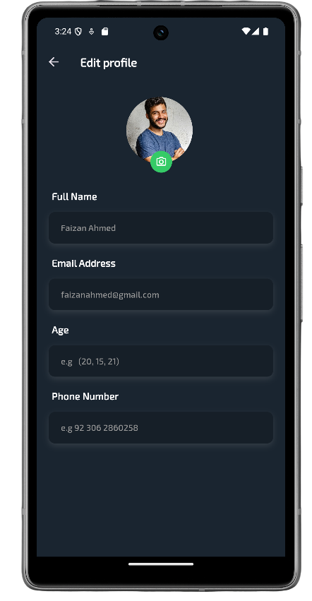     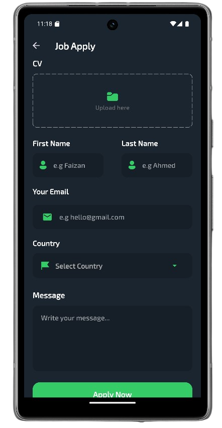 


---


## ⚙️ **How It Works**  
### 1️⃣ User Authentication  
- Users can **sign up** using email and password.  
- **Google sign-in** is available for quick access.  
- Firebase Authentication handles login and logout securely.  

### 2️⃣ Browsing & Searching Jobs  
- Users can browse through a **list of job postings**.  
- Advanced search allows filtering jobs based on skills, salary, location, and experience.  

### 3️⃣ Applying for Jobs  
- Users can **apply for jobs** directly inside the app.  
- Resumes and cover letters can be uploaded securely.  
- Users can track their **job application status**.  

### 4️⃣ Employer Dashboard  
- Employers can **post job listings** with requirements.  
- Manage and review applicants.  
- Communicate with candidates via **real-time chat**.  


---


## 🔥 **Firebase Configuration**  
1️⃣ Create a **Firebase Project**  
2️⃣ Add an **Android & iOS App**  
3️⃣ Download the **google-services.json** file and place it inside:  
```
android/app/
```  
4️⃣ Enable **Authentication** (Email/Google)  
5️⃣ Set up **Firestore Database** with collections for **jobs, users, and applications**  
6️⃣ Enable **Firebase Storage** for resumes and company images  


---


## 🛠 **Admin Panel**  
- Admins can **manage job postings** and review applications.  
- View **job seeker statistics** and application trends.  
- **Approve or reject** employer job postings.  


---


## 📜 **License**  
This project is licensed under the **MIT License**.  


---


## 🧑 **Author**  
**Faizan Ahmed**  
🔗 **LinkedIn:** [Your LinkedIn Profile](https://www.linkedin.com/in/faizan-ahmed-303793255/)  


---


### ⭐ **Support & Follow**  
If you liked this repo, please **support it by giving a star ⭐!**  
Also, follow my **GitHub profile** to stay updated about my latest projects:  
🔗 **GitHub:** [Your GitHub Profile](https://github.com/FaizanAhmed44)  


---
